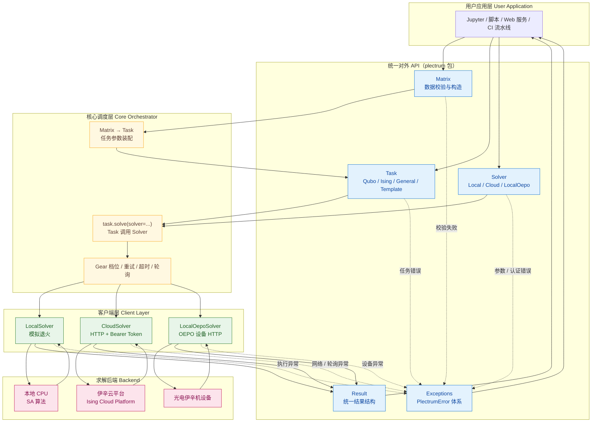
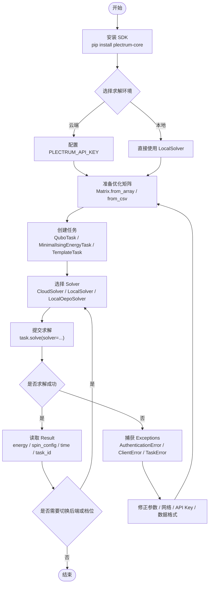
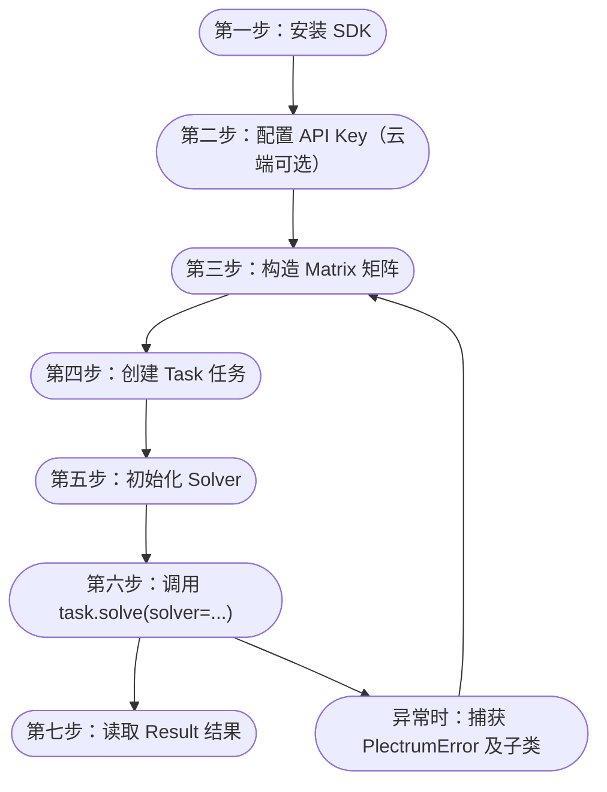

# 玉盘伊辛云-拨片优化求解开发包-核心包（Plectrum Core） 软件著作权登记材料

> 本文档基于《老年人入住信息档案管理平台》软著模板生成，作为
> **Plectrum SDK（拨片优化求解 SDK）** 软件著作权登记的源代码 / 用户操作手册材料。
> 本文档采用 **Markdown + Mermaid + 代码块示例** 的方式组织材料，用户操作手册部分不再依赖代码截图，
> 而是通过可直接复制运行的 `bash` / `python` 代码块说明安装、建模、求解与结果获取流程。

---

## 一、软件基本信息

| 项目 | 内容 |
| --- | --- |
| **软件全称** | 玉盘伊辛云-拨片优化求解开发包-核心包（Plectrum Core） |
| **软件简称** | 拨片SDK / plectrum-core |
| **版本号** | V1.0 |
| **软件分类** | 应用软件 / 系统软件开发工具包（SDK） |
| **开发的硬件环境** | CPU：Apple M2 Pro 10 核 / Intel Core i7 8 核及以上；内存：16GB 及以上 |
| **运行的硬件环境** | CPU：Intel Core i5 4 核及以上 / Apple M 系列；内存：8GB 及以上 |
| **开发该软件的操作系统** | macOS 14 Sonoma / Ubuntu 22.04 LTS / Windows 11 |
| **软件开发环境 / 开发工具** | PyCharm 2024.1、Python 3.10 / 3.13、pytest 8.x、setuptools、Git |
| **该软件的运行平台 / 操作系统** | 跨平台：Windows 10/11、macOS 12+、Linux（Ubuntu / CentOS / Debian） |
| **软件运行支撑环境 / 支持软件** | Python ≥ 3.8、NumPy ≥ 1.20、Pandas ≥ 1.3、Requests ≥ 2.25 |
| **编程语言** | Python |
| **源程序量** | 约 1607 行（不含测试与注释空行） |
| **开发目的** | 为用户提供统一、易用的优化求解器调用接口，屏蔽云端与本地求解器底层差异，加速 QUBO / Ising 优化问题在科研与工业场景的应用落地 |
| **面向领域 / 行业** | 启发优化、组合优化、运筹学、金融建模、物流调度、机器学习、量子计算程序设计 |

---

## 二、软件的主要功能

**Plectrum SDK（拨片优化求解 SDK）** 是一款面向 QUBO（二次无约束二进制优化）与 Ising
（伊辛自旋系统）问题的统一 Python 软件开发工具包，以"统一接口、灵活求解器切换、多形态任务建模"
为核心，将云端伊辛云平台（Ising Cloud Platform）求解器、本地模拟退火求解器、本地 光电伊辛机设备求解器封装为同一组 API，使科研与工业用户可以在一份代码中无缝切换求解后端，
极大降低了优化问题落地与算法对比的工程成本。

SDK 采用模块化架构设计，自下而上由 **数据层（Matrix）**、**任务层（Task）**、
**求解器层（Solver / Client）**、**结果层（Result）** 与 **统一异常体系（Exceptions）**
五个模块组成。**Matrix 模块** 提供从 NumPy 数组、CSV 文件、CSV 字符串多种渠道构建优化矩阵的
能力，并在构造时校验形状、NaN/Inf、非数值等异常输入；**Task 模块** 提供四种任务类型：
QuboTask（二进制 0/1 变量）、MinimalIsingEnergyTask（自旋 ±1 变量）、GeneralTask（通用基类）
与 TemplateTask（云端模板任务）；**Solver 模块** 提供 CloudSolver（伊辛云平台 HTTP 求解）、
LocalSolver（本地模拟退火）、LocalOepoSolver（局域 OEPO 设备 HTTP 求解）三种求解器，并通过
Gear 档位（FAST / BALANCED / PRECISE）控制速度与精度的平衡；**Result 模块** 将不同求解器返回
的异构结果统一为同一数据结构，包含 energy（能量）、spin_config（解向量）、time（耗时）、
ok（成功标志）与 task_id（任务 ID）等字段；**Exceptions 模块** 提供以 `PlectrumError`
为根的层级化异常体系，包括 `AuthenticationError`、`ClientError`、`TimeoutError`、
`ConnectionError`、`TaskError`、`MatrixError`、`ValidationError`，所有异常通过 `__cause__`
保留原始堆栈，便于排错。

SDK 完整支持 **任务建模 → 求解器选择 → 任务提交 → 结果轮询 → 结果统一返回 → 异常处理** 的端到端
流程，实现了从本地调试到云端生产的一键切换。系统同时支持环境变量与显式参数两种 API Key
配置方式（`PLECTRUM_API_KEY`），并通过 `pip install plectrum-core` 一键安装，可轻松集成进
Jupyter Notebook、企业内部数据中台、CI/CD 流水线、Web 服务端等多种环境，为组合优化与启发
优化的工业化落地提供可靠的工程支撑，推动启发优化算法走向规模化、规范化、高效化应用。

## 三、软件的技术特点

云计算软件 / 跨平台 SDK。系统的健壮性很强，通过完整的输入校验、统一异常体系、超时
与重试机制，当系统面临网络抖动、输入错误、API Key 缺失、矩阵格式异常等因素时，系统
具有能够抵御出现非预期状态、可向上层调用方清晰报告错误原因的特性，并保留完整的原始
异常链路（`__cause__`），方便上层应用进行可观测性追踪与故障恢复。

### 3.1 总体架构图

下图给出 Plectrum Core 的总体分层架构。图中重点标注了 `Solver` 与
`Matrix`、`Task`、`Result`、`Exceptions` 以及后端算力之间的关系：

- `Matrix` 负责提供规范化输入数据；
- `Task` 负责封装问题语义；
- `Solver` 是 `task.solve(solver=...)` 的执行入口；
- `Solver` 向下连接本地 / 云端 / 专用设备后端；
- `Solver` 的返回结果统一收敛到 `Result`，错误统一收敛到 `Exceptions`。



**架构说明：**

- **用户应用层** 通过 `from plectrum import ...` 调用统一 API；
- **统一对外 API** 暴露 5 个核心对象：`Matrix` / `Task` / `Solver` / `Result` / `Exceptions`；
- **Solver 与其他模块的关系** 是：用户先构造 `Matrix`，再创建 `Task`，最后通过 `task.solve(solver=...)`
  将 `Task` 交给 `Solver` 执行；
- **核心调度层** 负责接收 `Task + Solver` 组合、按 `Gear` 档位下发，并处理重试、超时与轮询；
- **客户端层** 屏蔽不同后端的协议差异（本地 / HTTP）；
- **求解后端** 包含本地 CPU、伊辛云平台、光电伊辛机设备三种实际算力；
- **结果与异常** 均通过统一通道返回至用户应用层，确保不同后端拥有一致的编程模型。

### 3.2 用户使用流程图

下图展示典型用户从安装到获取结果的完整使用流程：



**流程说明：**

- 本地求解场景可直接跳过 API Key 配置；
- 云端求解场景建议优先使用环境变量 `PLECTRUM_API_KEY`；
- 当结果不理想时，可不改动 `Task` 定义，直接切换 `Solver` 或 `Gear` 档位进行对比；
- 当发生异常时，应优先检查矩阵格式、任务参数、网络连通性和 API Key 是否正确。

---

## 四、用户使用说明书

本章按照软著申请材料常见审查要求，围绕 **引言与运行环境、总体设计与架构图、核心功能与接口说明、
代码示例/调用流程、注意事项** 五部分展开。说明书使用代码块代替界面截图，便于审查人员直接看到 SDK
的类、接口、参数与调用方式。

### 4.1 引言与运行环境

#### 4.1.1 开发目的与适用领域

玉盘伊辛云-拨片优化求解开发包-核心包（Plectrum Core）是一款面向优化求解场景的 Python SDK。
其开发目的在于通过统一接口封装 **云端伊辛云平台求解器、本地模拟退火求解器、本地光电伊辛机设备求解器**，
帮助开发者在不改变业务建模代码的前提下，实现不同后端算力之间的快速切换，从而降低优化算法接入成本、
加速应用落地并提升工程集成效率。

本 SDK 适用于以下领域：

- 组合优化与离散优化；
- 运筹学建模与调度优化；
- 金融组合优化与风险控制；
- 物流路径规划、资源分配、排班排产；
- 量子启发优化、伊辛模型研究与教学实验；
- 面向企业服务端、科研脚本、Jupyter Notebook、数据平台和 API 服务的优化求解集成。

#### 4.1.2 最低运行环境要求

| 项目 | 最低要求 | 说明 |
| --- | --- | --- |
| 操作系统 | Windows 10 / macOS 12 / Ubuntu 20.04 及以上 | 跨平台运行 |
| Python 版本 | Python 3.8 及以上 | 推荐 3.10+ |
| 核心依赖库 | `numpy>=1.20`、`requests>=2.25` | `pandas` 为可选依赖，用于 DataFrame 输入 |
| 网络要求 | 云端求解需可访问伊辛云平台接口 | 本地求解可离线运行 |
| CPU / 内存 | 双核 CPU、8GB 内存及以上 | 中大规模问题建议更高配置 |
| API Key | 仅 `CloudSolver` 必需 | 可通过环境变量 `PLECTRUM_API_KEY` 注入 |
| Android / iOS | 不适用 | 本 SDK 为 Python SDK，不是原生移动端 SDK |

#### 4.1.3 安装与初始化

通过 PyPI 安装：

```bash
pip install plectrum-core
```

从源码开发安装：

```bash
pip install -e ".[dev]"
```

云端求解场景推荐通过环境变量配置 API Key：

```bash
export PLECTRUM_API_KEY="********************************"
```

基础导入方式如下：

```python
from plectrum import (
    Matrix,
    QuboTask,
    MinimalIsingEnergyTask,
    GeneralTask,
    TemplateTask,
    CloudSolver,
    LocalSolver,
    LocalOepoSolver,
    Result,
    GEAR_FAST,
    GEAR_BALANCED,
    GEAR_PRECISE,
    PlectrumError,
)
```

### 4.2 总体设计与架构图

SDK 采用 **矩阵数据层 → 任务建模层 → 求解器层 → 结果层 / 异常层** 的分层架构。
其中 `Solver` 位于核心执行路径上：开发者将 `Task` 与 `Solver` 组合后，通过
`task.solve(solver=...)` 发起求解；`Solver` 再根据具体类型与后端协议交互，最终返回统一结构的 `Result`，
或者抛出统一体系的 `Exceptions`。

#### 4.2.1 SDK 架构图

```mermaid
flowchart TB
    U["开发者应用层<br/>Jupyter / 脚本 / Web 服务 / 数据平台"]
    M["Matrix 模块<br/>矩阵构造 / CSV 转换 / 数据校验"]
    T["Task 模块<br/>QuboTask / MinimalIsingEnergyTask / GeneralTask / TemplateTask"]
    S["Solver 模块<br/>CloudSolver / LocalSolver / LocalOepoSolver"]
    R["Result 模块<br/>统一返回 energy / spin_config / time / task_id"]
    E["Exceptions 模块<br/>PlectrumError 及子类"]
    B1["本地模拟退火后端"]
    B2["伊辛云平台后端"]
    B3["光电伊辛机后端"]

    U --> M
    U --> T
    U --> S
    M --> T
    T -->|task.solve(solver=...)| S
    S --> B1
    S --> B2
    S --> B3
    B1 --> S
    B2 --> S
    B3 --> S
    S --> R
    M -. 输入校验失败 .-> E
    T -. 任务构造/执行失败 .-> E
    S -. 认证/网络/设备异常 .-> E
    R --> U
    E --> U
```

#### 4.2.2 模块逻辑关系说明

- `Matrix`：负责将 `numpy.ndarray`、CSV 文件、CSV 字符串等数据统一封装为矩阵对象；
- `Task`：负责表达具体优化问题类型与任务参数；
- `Solver`：负责执行求解，是 SDK 内部连接任务与后端的核心模块；
- `Result`：将本地、云端、设备端返回的数据标准化为统一结构；
- `Exceptions`：对输入、认证、网络、任务、矩阵异常统一建模，方便调用方统一处理。

### 4.3 核心功能与接口说明

#### 4.3.1 核心功能模块说明

| 模块 | 核心能力 | 说明 |
| --- | --- | --- |
| `Matrix` | 数据构造、CSV 转换、数值校验 | 支持数组 / CSV 文件 / CSV 字符串三种输入方式 |
| `Task` | 问题建模 | 支持 QUBO、Ising、通用任务、模板任务 |
| `Solver` | 求解器调度 | 支持本地模拟退火、伊辛云平台、光电伊辛机设备 |
| `Result` | 结果标准化 | 统一输出 `energy`、`spin_config`、`time`、`task_id` 等字段 |
| `Exceptions` | 错误治理 | 统一处理认证失败、连接失败、超时、任务错误、矩阵错误 |

#### 4.3.2 关键类说明

| 类名 | 所属模块 | 功能描述 |
| --- | --- | --- |
| `Matrix` | `plectrum.matrix` | 优化矩阵封装与 CSV 工具类 |
| `QuboTask` | `plectrum.task` | 二进制 QUBO 优化任务 |
| `MinimalIsingEnergyTask` | `plectrum.task` | Ising 最小能量任务 |
| `GeneralTask` | `plectrum.task` | 通用任务基类，适合扩展场景 |
| `TemplateTask` | `plectrum.task` | 云端模板任务 |
| `CloudSolver` | `plectrum.client` | 云端 HTTP 求解器 |
| `LocalSolver` | `plectrum.client` | 本地模拟退火求解器 |
| `LocalOepoSolver` | `plectrum.client` | 本地光电伊辛机设备求解器 |
| `Result` | `plectrum.result` | 统一结果对象 |
| `PlectrumError` | `plectrum.exceptions` | 所有 SDK 异常的根异常 |

#### 4.3.3 核心接口/API 说明

##### （1）Matrix 模块接口

| 类 / 方法 | 参数说明 | 返回值 | 说明 |
| --- | --- | --- | --- |
| `Matrix(data)` | `data: np.ndarray` | `Matrix` | 使用二维数值矩阵创建对象，非法输入抛 `MatrixError` |
| `Matrix.from_array(array)` | `array: np.ndarray` | `Matrix` | 从 NumPy 数组创建矩阵 |
| `Matrix.from_csv(file_path)` | `file_path: str` | `Matrix` | 从 CSV 文件读取矩阵 |
| `Matrix.from_csv_string(csv_string)` | `csv_string: str` | `Matrix` | 从 CSV 文本创建矩阵 |
| `Matrix.to_csv_string()` | 无 | `str` | 将矩阵转换为 CSV 字符串 |
| `Matrix.shape` | 无 | `tuple` | 返回矩阵维度 |
| `Matrix.data` | 无 | `np.ndarray` | 返回底层数组 |

##### （2）Task 模块接口

| 类 / 方法 | 参数说明 | 返回值 | 说明 |
| --- | --- | --- | --- |
| `BaseTask.solve(solver)` | `solver: BaseSolver` | `dict` | 统一求解入口，将任务提交给指定求解器 |
| `BaseTask.to_dict()` | 无 | `dict` | 将任务转换为底层求解字典 |
| `QuboTask(name, data, shot_count, ...)` | `name` 任务名；`data` 矩阵；`shot_count` 迭代次数 | `QuboTask` | 用于创建 QUBO 优化任务 |
| `MinimalIsingEnergyTask(name, data, shot_count, ...)` | 同上 | `MinimalIsingEnergyTask` | 用于创建 Ising 最小能量任务 |
| `GeneralTask(name, data, shot_count, post_process, ...)` | 通用参数集合 | `GeneralTask` | 适合扩展型任务定义 |
| `TemplateTask(name, template_id, gear, payload)` | 模板 ID、档位、负载数据 | `TemplateTask` | 调用云端预置模板任务 |

##### （3）Solver 模块接口

| 类 / 方法 | 参数说明 | 返回值 | 说明 |
| --- | --- | --- | --- |
| `CloudSolver(api_key, host, computer_type, gear, poll_interval, timeout)` | 云端认证与轮询参数 | `CloudSolver` | 初始化云端求解器 |
| `CloudSolver.solve(task_data)` | `task_data: dict` | `dict` | 提交任务并自动轮询结果 |
| `CloudSolver.get_task(task_id)` | `task_id: str` | `dict` | 查询单个云端任务状态 |
| `CloudSolver.get_task_list(page_no, page_size)` | 分页参数 | `dict` | 查询任务列表 |
| `CloudSolver.upload_file(file_path_or_bytes, original_filename)` | 文件路径或字节流 | `dict` | 上传矩阵文件到对象存储 |
| `LocalSolver(gear, algorithm)` | 档位、算法名 | `LocalSolver` | 初始化本地模拟退火求解器 |
| `LocalSolver.solve(task_data)` | `task_data: dict` | `dict` | 本地同步求解 |
| `LocalOepoSolver(host, api_path, computer_type, gear)` | 本地设备接口参数 | `LocalOepoSolver` | 初始化设备求解器 |
| `LocalOepoSolver.solve(task_data)` | `task_data: dict` | `dict` | 将任务发送到本地设备接口 |

##### （4）Result 与异常接口

| 类 / 方法 | 参数说明 | 返回值 | 说明 |
| --- | --- | --- | --- |
| `Result.to_dict()` | 无 | `dict` | 将结果转为统一字典 |
| `Result.from_cloud(raw_result, task_id)` | 云端原始结果、任务 ID | `Result` | 解析云端结果 |
| `Result.from_local(raw_result, task_id)` | 本地原始结果、任务 ID | `Result` | 解析本地/设备结果 |
| `PlectrumError` | `message: str` | 异常对象 | SDK 根异常，可统一捕获 |
| `AuthenticationError` | 无 | 异常对象 | API Key 缺失或无效 |
| `ClientError` | 无 | 异常对象 | HTTP / 通信 / 协议错误 |
| `TimeoutError` | 无 | 异常对象 | 超时错误 |
| `ConnectionError` | 无 | 异常对象 | 网络连接错误 |
| `TaskError` | 无 | 异常对象 | 任务构造或执行错误 |
| `MatrixError` | 无 | 异常对象 | 矩阵数据错误 |
| `ValidationError` | 无 | 异常对象 | 通用输入校验错误 |

### 4.4 代码示例与调用流程

#### 4.4.1 开发者调用流程图



#### 4.4.2 示例一：本地求解调用流程

**第一步：构造优化矩阵**

```python
import numpy as np
from plectrum import Matrix

matrix = Matrix.from_array(
    np.array([
        [-2, 1, 1, 0],
        [1, -2, 0, 1],
        [1, 0, -2, 1],
        [0, 1, 1, -2],
    ])
)
```

**第二步：创建任务对象**

```python
from plectrum import QuboTask

task = QuboTask(name="local-demo", data=matrix.data, shot_count=10)
```

**第三步：初始化本地求解器**

```python
from plectrum import LocalSolver, GEAR_PRECISE

solver = LocalSolver(gear=GEAR_PRECISE)
```

**第四步：发起求解并获取结果**

```python
result = task.solve(solver=solver)
print(result["result"]["energy"])
print(result["result"]["spin_config"])
```

示例输出：

```text
-4.0
[1, 0, 0, 1]
```

#### 4.4.3 示例二：云端求解调用流程

**第一步：配置云端访问凭据**

```bash
export PLECTRUM_API_KEY="********************************"
```

**第二步：创建任务并初始化云端求解器**

```python
import numpy as np
from plectrum import QuboTask, CloudSolver, GEAR_BALANCED

data = np.array([
    [-2, 1, 1, 0],
    [1, -2, 0, 1],
    [1, 0, -2, 1],
    [0, 1, 1, -2],
])

task = QuboTask(name="cloud-demo", data=data, shot_count=10)
solver = CloudSolver(api_key="********************************", gear=GEAR_BALANCED)
```

**第三步：提交任务并自动轮询结果**

```python
result = task.solve(solver=solver)
print(result["task_id"])
print(result["result"]["energy"])
print(result["result"]["spin_config"])
```

**第四步：按任务 ID 查询任务状态**

```python
task_info = solver.get_task(result["task_id"])
print(task_info)
```

#### 4.4.4 示例三：统一异常处理流程

```python
from plectrum import CloudSolver, AuthenticationError, ClientError, TaskError

try:
    solver = CloudSolver(api_key="********************************")
except AuthenticationError as e:
    print("认证失败：", e)
except ClientError as e:
    print("客户端错误：", e)
except TaskError as e:
    print("任务错误：", e)
```

### 4.5 注意事项

1. **本 SDK 为 Python SDK**，主要面向服务端、科研脚本和桌面开发环境，**不适用于原生 Android / iOS 集成**；
2. 使用 `CloudSolver` 时必须提供有效 API Key，建议通过环境变量 `PLECTRUM_API_KEY` 管理；
3. `LocalSolver` 为本地同步求解器，不依赖网络，但要求任务能够提供有效矩阵数据；
4. `TemplateTask` 主要面向云端模板任务场景，不适用于本地模拟退火求解器；
5. 当需要进行高质量求解时，建议优先选择 `GEAR_PRECISE`；若更关注响应速度，可选择 `GEAR_FAST`；
6. 当输入矩阵存在空值、非数值、NaN、Inf 或维度不合法时，SDK 会抛出 `MatrixError`；
7. 当后端网络不可达、接口响应异常或任务超时时，SDK 会抛出 `ConnectionError`、`ClientError`、`TimeoutError` 等异常；
8. 说明书中已包含 **架构图** 与 **调用流程图**，满足软著材料对图示化说明的要求。

### 4.6 性能对比基准（LocalSolver 三档）

我们对 `LocalSolver` 在三种 `Gear` 档位（`FAST` / `BALANCED` / `PRECISE`）下，
针对规模 N = 10 / 20 / 40 的随机对称 QUBO 矩阵进行了实测，使用 `seaborn`
绘制柱状对比图，左侧为 **求解耗时**（越低越好），右侧为 **求解能量质量**
（能量越低越好）。该图由脚本 [`benchmark_plot.py`](./benchmark_plot.py)
自动生成，便于复现：

```bash
python 软著/benchmark_plot.py
```

> 

**结论：**

- 三档之间耗时差异明显，体现了速度与精度的权衡；
- `BALANCED` 档适合作为通用默认配置；
- 对解质量要求较高时，建议使用 `PRECISE` 档。

---

## 五、相关链接

- **伊辛云平台**：https://console.isingq.com/
- **公司官网**：https://www.isingq.com
- **PyPI 包**：https://pypi.org/project/plectrum-core/

## 六、版权声明

Apache License 2.0
Copyright (c) 2026 Ising Tech. All rights reserved.


